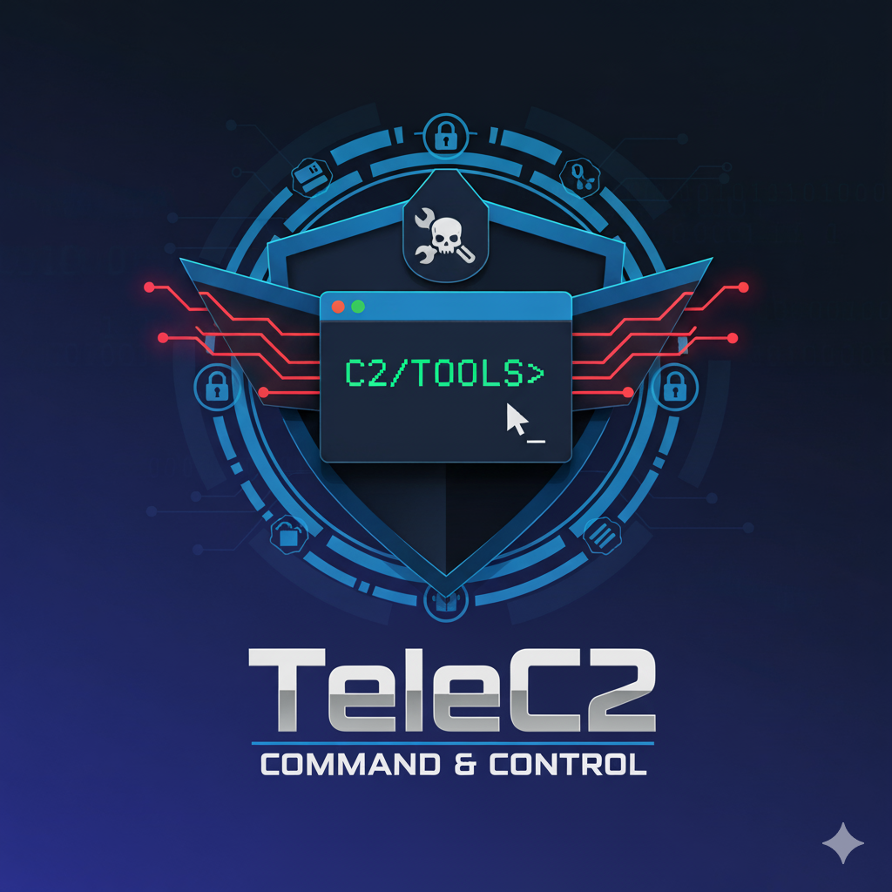

# TeleC2 - Telegram Command and Control System


<p align="center">
  
</p>


TeleC2 is a Python-based Remote Administration Tool (RAT) that leverages the Telegram Bot API for covert command and control (C2) communication. This allows an operator to remotely manage and monitor systems from anywhere using a simple Telegram chat interface.

The script includes features for remote command execution, file system management, surveillance (screenshots, webcam), keylogging, and more, with a focus on ease of use and stealth.

**Disclaimer** : ⚠️ This tool is intended for educational and research purposes only. The author is not responsible for any misuse or damage caused by this program. Using this tool on systems where you do not have explicit permission is illegal and unethical.


## Features

- **Telegram-based C2**: Uses the Telegram Bot API for all communications, making it difficult to block.
- **Encrypted Configuration**: Securely stores API keys and chat IDs in an encrypted file.
- **Agent Management**: Remotely list, interact with, and terminate agents.
- **Remote Shell**: Execute system commands (cmd) and PowerShell (pow) commands directly from Telegram.
- **System Information**: Gather detailed information about the target system (OS, IP, CPU, etc.).
- **File System Operations**: View the contents of files and download files from the target machine.

- **Surveillance Suite**:

  - Take screenshots of the desktop.

  - Capture images from the webcam.

  - Record video clips from the webcam.

- **Advanced Keylogger**:

  - Captures keystrokes and sends them to a separate, dedicated Telegram bot.

  - Buffers keystrokes and sends them periodically to minimize network traffic.

  - Includes a utility to clean and format raw keylog data.

 - **Prank Module**: Includes functions to display fake error messages or attempt to crash the system.

- **Clipboard Access**: View the contents of the target's clipboard.

# 🔧 Setup and Installation

## Installation

**1. Clone the repository:**
```
git clone https://github.com/yourusername/telec2.git
```
```
cd telec2
```

**2. Install required dependencies:**

```
pip install -r requirements.txt
```

**3. Set up your Telegram bots:**

- Create two bots using BotFather
- Note down the API tokens for both bots

**4. Configure the agent:**

- Update the encryption password in the script
- Run the script to generate encrypted configuration

### Usage

**1. Start the agent:**

```
python agent.py
```

**2. Send commands to your Telegram bot:**

```
/start - Register agent and show available systems
/scan - List all active agents
/info <agent_id> - Get system information
/die <agent_id> - Terminate agent
/screenshot <agent_id> - Capture screen

/webcam <agent_id> - Capture webcam image
/video <agent_id> <duration> - Record webcam video
/keylogger <start|stop|status> <agent_id> - Control keylogger
/clip <agent_id> - Get clipboard contents

/cmd <agent_id> <command> - Execute system command
/pow <agent_id> <command> - Execute PowerShell command
/viewFile <agent_id> <path> - View file contents
/downloadFile <agent_id> <path> - Download file

```

